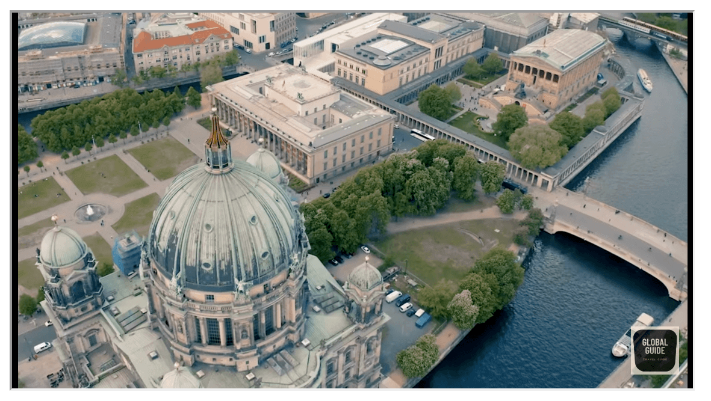

<h1 align="center">Tausendlin :european_castle:</h1>

<h3 align="center"><a href="https://davidtausend.github.io/tausendlin/">➡️ View the live project here ⬅️</a></h3>

 

## Introduction

We're here to take you on an imaginative journey through Tausendlin. Our website is designed to be your single-stop gateway to the vibrant and diverse experiences this city offers.

Explore Tausendlin captures the essence of Tausendlin with a focus on bold and striking design, inviting you to explore its rich history, art, culture, and culinary delights. Join us as we unravel the extraordinary story of this captivating city. Your adventure begins here!

## Table of Contents

- [Introduction](#introduction)
- [Table of Contents](#table-of-contents)
- [User Experience (UX)](#user-experience--ux-)
  * [User Stories](#user-stories)
    + [User goals](#user-goals)
    + [Company goals](#company-goals)
- [Design](#design)
  * [Typography](#typography)
  * [Color Scheme](#color-scheme)
  * [Components](#components)
  * [Wireframes](#wireframes)
- [Features](#features)
  * [Navigation Bar](#navigation-bar)
  * [Hero Section](#hero-section)
  * [Place tips](#place-tips)
  * [Event tips](#event-tips)
  * [Video](#video)
  * [Footer](#footer)
  * [Review form](#review-form)
  * [Contact form](#contact-form)
  * [404 Page](#404-page)
- [Technologies](#technologies)
  * [Programming Languages](#programming-languages)
  * [Applications, Plugins & Tools Used](#applications--plugins---tools-used)
- [Deployment & Local Development](#deployment---local-development)
  * [Deployment](#deployment)
  * [Local Development](#local-development)
    + [How to Fork](#how-to-fork)
    + [How to Clone](#how-to-clone)
    + [Committing and Pushing Changes](#committing-and-pushing-changes)
- [Testing](#testing)
  * [Automated Testing](#automated-testing)
    + [Validator Testing](#validator-testing)
      - [HTML](#html)
      - [CSS](#css)
    + [LightHouse](#lighthouse)
      - [Desktop](#desktop)
      - [Mobile](#mobile)
      - [Improvements](#improvements)
      - [Final Score](#final-score)
  * [Manual testing](#manual-testing)
    + [User Stories Testing](#user-stories-testing)
    + [Full Testing](#full-testing)
      - [Devices](#devices)
      - [Browsers](#browsers)
  * [Bugs](#bugs)
    + [Known Bugs](#known-bugs)
    + [Solved Bugs](#solved-bugs)

[Generate TOC](https://ecotrust-canada.github.io/markdown-toc/)

## User Experience (UX)

The "Tausendlin" website is a comprehensive platform dedicated to providing visitors with the top best places to explore and enjoy the vibrant city of Tausendlin. This UX design focuses on enhancing the user experience and achieving specific user and organizational goals.

### User Stories

#### User goals

+ As a user, I want to easily find information about popular tourist attractions in Tausendlin.
+ As a user, I want to discover recommendations for local events and cuisine.
+ As a user, I want to easily plan guide tour around the city.

#### Company goals

+ As an organization, we want to promote Tausendlin as a top tourist destination.
+ As an organization, we want to leverage social media to connect with travelers and share updates.
+ As an organization, we want to provide cost-effective advertising opportunities for local businesses.
+ As an organization, we want to facilitate user reviews and ratings of the travel expierence.

## Design

### Typography

The project features 'Roboto' for body text and 'Open Sans' for headings, combining modernity and readability. This pairing ensures elegance and functionality, with fallback to the browser's default sans-serif font for reliability. Text sizes and spacing are optimized for legibility and aesthetic appeal.

### Color Scheme

The project's color scheme is inspired by the Tausendlin flag, featuring cherry red (#990011) for emphasis and dark grey (#201E20) for body text, creating a professional contrast. The header background is pure white (#FFFFFF) for clear readability. Social network icons are highlighted with distinct colors: blue (#0000FF) for Facebook and Twitter, deep red (#e60f00) for YouTube, and orange-brown (#d24d14) for Instagram.

### Components

TThe project features a component-centric design for versatility and reusability. Key components include a fixed navigational header, a dynamic hero section, and an interactive slideshow container. Highlight sections and galleries are designed to showcase content attractively and cohesively, ensuring a consistent user experience.

### Imagery

The project uses imagery aligned with its theme and color scheme, mainly featuring Tausendlin's landmarks and cultural highlights. Formats like slideshows, galleries, and highlight sections, optimized for responsive viewing, enhance the site's visual storytelling and user engagement.

### Wireframes

The wireframes for the project were key in planning the site's layout and functionality. Initially, they offered a basic layout focusing on the arrangement of headers, navigation, and content areas. As the design evolved, these wireframes incorporated detailed elements like typography and color schemes, aiding in visualizing the final design. This process was crucial for ensuring a cohesive and user-friendly website.

+ [Desktop wireframe]()
+ [iPad wireframe]()
+ [iPhone wireframe]()

## Features

### Navigation Bar

+ The navigation bar offers easy access to different pages sections and adapts to various screen sizes, aligning with the site's design theme.

+ It becomes sticky at the top after scrolling past the hero section, allowing quick navigation without scrolling back up.
 

+ On smaller screens, the navbar condenses into a hamburger icon with a feature animation, ensuring a clutter-free and user-friendly interface. When clicked, opens an overlay menu with spaced-out links for easy navigation.

### Hero Section

+ Occupying the full screen width and located above the fold, the Hero Section immediately grabs visitor attention.

+ It's optimized for visual appeal across devices, from desktops to mobiles, encouraging further engagement with the site.

+ This section sets the website's tone, blending impactful visuals with strategic placement for maximum user interaction.

### Place tips

+ Offers practical advice and tips for visitors to Tausendlin, enhancing their travel experience.

+ Features an easy-to-navigate layout with a blend of text and images for engaging content presentation.

### Event tips

+ Showcases upcoming events in Tausendlin, keeping visitors informed about cultural, entertainment, and community happenings.

+ The layout is user-friendly, making it easy for visitors to discover and plan for different events.

+ Includes detailed descriptions and imagery for each event, enhancing the appeal and providing a comprehensive overview.

+ Updated regularly to ensure the information is current and offers a variety of options for different interests and age groups.

### Video

+ Highlights engaging videos that showcase Tausendlin's attractions, culture, and lifestyle.

+ Positioned to capture user interest and provide a dynamic, multimedia experience of the city.

+ Videos are thoughtfully selected and embedded for optimal performance across devices.

+ Offers visitors a visually immersive way to explore Tausendlin, complementing the textual and photographic content on the site.

### Review form

+ Enables visitors to share their experiences and feedback about Tausendlin, fostering a sense of community and engagement.

+ The form is designed for ease of use, with intuitive fields for user input, ensuring a seamless submission process.

+ Incorporates essential fields such as ratings, comments, and personal insights, allowing visitors to provide comprehensive reviews.

+ Positioned strategically to encourage participation after visitors have explored the site's content, enhancing the interactivity of the user experience.

### Contact form

+ Provides a direct and user-friendly way for visitors to get in touch with the site administrators or Tausendlin representatives.
+ The form is structured with clear fields for contact information and inquiries, ensuring ease of communication.
+ Designed to be accessible and straightforward, encouraging visitors to reach out with questions, suggestions, or additional information requests.
+ Enhances the site's functionality by offering a reliable communication channel, integral for user support and engagement.

### 404 Page

+ Custom-designed to address broken links or non-existent pages in a user-friendly manner.

+ Features helpful navigation options and a creative layout to guide visitors back to the main site.

+ Aims to reduce user frustration and encourage continued exploration of the website.

### Footer

+ Contains vital links, contact information, and social media icons, easily accessible on every page.

+ Designed for clarity and ease of use, facilitating quick navigation and resource access.

+ Offers a cohesive and professional finish to each page of the website.

## Technologies

### Programming Languages

- [HTML5](https://en.wikipedia.org/wiki/HTML5)
- [CSS3](https://en.wikipedia.org/wiki/CSS)
- [JavaScript](https://en.wikipedia.org/wiki/JavaScript)

### Applications, Plugins & Tools Used

[Gitpod](https://www.gitpod.io): Gitpod served as my primary IDE for HTML, CSS, and JavaScript development, offering a seamless environment for coding and real-time change previews.

[Github](https://github.com/): Github was essential for repository hosting, enabling code sharing, and project management.

[Favicon](https://www.flaticon.com/): Flaticon provided a range of social media icons suitable for use as favicons on the site.

[Google fonts](https://fonts.google.com): Used to enhance the website's typography, ensuring visual appeal and readability with a variety of font options.

[Mycolor](https://mycolor.space/): Assisted in selecting a cohesive color palette, significantly impacting the website's aesthetic and user experience.

[Tiny](https://tinypng.com/): TinyPNG was instrumental in compressing images for the web, reducing file sizes without substantial quality loss and improving website loading times.

[Git](https://git-scm.com/): Employed for version control, facilitating efficient code changes management and team collaboration.

[ChatGPT](https://chat.openai.com/auth/login): Provided assistance in content creation, spell-checking, and code improvement suggestions, especially in accessibility and semantic naming.

[Shields](https://shields.io/): Used to create and integrate badges into the README for enhanced project documentation.

[Resize images](https://www.iloveimg.com/resize-image): Utilized for resizing images, ensuring they fit well within the website's design while maintaining quality. This tool was crucial for optimizing images for different screen sizes and improving the overall visual presentation of the site.

[Am I Responsive](https://ui.dev/amiresponsive): This tool was used to display how the website looks across different devices, ensuring responsive design.

[Lighthouse](https://chromewebstore.google.com/detail/lighthouse/blipmdconlkpinefehnmjammfjpmpbjk?hl=de): Employed for auditing the website's performance, accessibility, and SEO, providing insights for improvements and optimizations.

## Deployment & Local Development

### Deployment

### Local Development

#### How to Fork

#### How to Clone

#### Committing and Pushing Changes

## Testing

### Automated Testing

#### Validator Testing

##### HTML

##### CSS

#### LightHouse

##### Desktop

##### Mobile

##### Improvements

##### Final Score

### Manual testing

#### User Stories Testing

#### Full Testing

##### Devices

##### Browsers

### Bugs

#### Known Bugs

#### Solved Bugs

## Credits

### Code Used And Tutorials

### Content

### Media

### Acknowledgments
 
Sources:
+ stackoverflow.com - Set uniform box height in CSS image gallery
+ sliderrevolution.com - The best CSS gallery code snippets to use yourself
+ w3schools.com - CSS Image Gallery
+ getbootstrap.com - CSS
+ developer.mozilla.org - Organizing your CSS
+ developer.mozilla.org - Sizing items in CSS
+ stackoverflow.com - How to fill white space with the image
+ support.wix.com - Changing the Spacing Between Gallery Items
+ adinstruments.com - Adding Whitespace to an Image using Microsoft Paint
+ forum.freecodecamp.org - I cannot get my image to fill up my entire page
+ medium.com - Use Snapseed expand tool to add extra space in your...
+ developer.apple.com - Fitting images into available space
+ developer.mozilla.org - letter-spacing
+ w3schools.com - CSS Text Indentation and Spacing
+ css-tricks.com - Creating space between text and images
+ forum.squarespace.com - Adjusting spacing for gallery section and overriding site margin
+ stackoverflow.com - CSS is there a way to set spacing between an image and text within the same class
+ w3.org - C8: Using CSS letter-spacing to control spacing within a word
+ stackoverflow.com - How to use media queries to change between table and list...
+ css-tricks.com - Responsive Data Tables
+ w3schools.com - Responsive Web Design Media Queries
+ w3schools.com - CSS Media Queries Examples
+ toptal.com - Responsive Web Design Media Query Examples Explained
+ blog.logrocket.com - Creating responsive data tables with CSS
+ tara.ai - How to Write Software Design Documents (SDD)
+ lucidchart.com - How to Create Software Design Documents
+ freecodecamp.org - How to write a good software design doc
+ slite.com - Software Design Documentation Template
+ eecs.berkeley.edu - How to Write a Design Document
+ medium.com - Designing better design documentation | Slava Shestopalov

[Back to Top ^](#introduction)