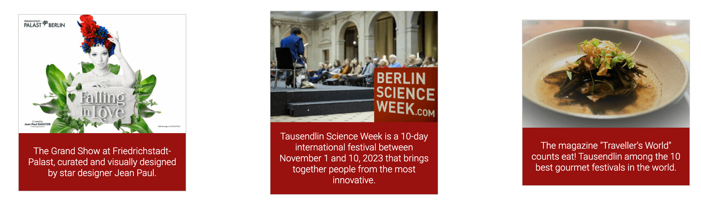

<h1 align="center">Tausendlin :european_castle:</h1>

<h3 align="center"><a href="https://davidtausend.github.io/tausendlin/">➡️ View the live project here ⬅️</a></h3>

 

## Introduction

We're here to take you on an imaginative journey through Tausendlin. Our website is designed to be your single-stop gateway to the vibrant and diverse experiences this city offers.

Explore Tausendlin captures the essence of Tausendlin with a focus on bold and striking design, inviting you to explore its rich history, art, culture, and culinary delights. Join us as we unravel the extraordinary story of this captivating city. Your adventure begins here!

 

## Table of Contents

- [Introduction](#introduction)
- [Table of Contents](#table-of-contents)
- [User Experience (UX)](#user-experience--ux-)
  - [User Stories](#user-stories)
    - [User goals](#user-goals)
    - [Company goals](#company-goals)
- [Design](#design)
  - [Typography](#typography)
  - [Color Scheme](#color-scheme)
  - [Components](#components)
  - [Wireframes](#wireframes)
- [Features](#features)
  - [Navigation Bar](#navigation-bar)
  - [Hero Section](#hero-section)
  - [Place tips](#place-tips)
  - [Event tips](#event-tips)
  - [Video](#video)
  - [Footer](#footer)
  - [Review form](#review-form)
  - [Contact form](#contact-form)
  - [404 Page](#404-page)
- [Technologies](#technologies)
  - [Programming Languages](#programming-languages)
  - [Applications, Plugins & Tools Used](#applications--plugins---tools-used)
- [Deployment & Local Development](#deployment---local-development)
  - [Deployment](#deployment)
  - [Local Development](#local-development)
    - [How to Fork](#how-to-fork)
    - [How to Clone](#how-to-clone)
    - [Committing and Pushing Changes](#committing-and-pushing-changes)
- [Testing](#testing)
  - [Automated Testing](#automated-testing)
    - [Validator Testing](#validator-testing)
      - [HTML](#html)
      - [CSS](#css)
    - [LightHouse](#lighthouse)
      - [Desktop](#desktop)
      - [Mobile](#mobile)
      - [Improvements](#improvements)
      - [Final Score](#final-score)
  - [Manual testing](#manual-testing)
    - [User Stories Testing](#user-stories-testing)
    - [Full Testing](#full-testing)
      - [Devices](#devices)
      - [Browsers](#browsers)
  - [Bugs](#bugs)
    - [Known Bugs](#known-bugs)
    - [Solved Bugs](#solved-bugs)

[Generate TOC](https://ecotrust-canada.github.io/markdown-toc/)

 

## User Experience (UX)

The "Tausendlin" website is a comprehensive platform dedicated to providing visitors with the top best places to explore and enjoy the vibrant city of Tausendlin. This UX design focuses on enhancing the user experience and achieving specific user and organizational goals.

### User Stories

#### User goals

- As a user, I want to easily find information about popular tourist attractions in Tausendlin.
- As a user, I want to discover recommendations for local events and cuisine.
- As a user, I want to easily plan guide tour around the city.

#### Company goals

- As an organization, we want to promote Tausendlin as a top tourist destination.
- As an organization, we want to leverage social media to connect with travelers and share updates.
- As an organization, we want to provide cost-effective advertising opportunities for local businesses.
- As an organization, we want to facilitate user reviews and ratings of the travel expierence.

## Design

### Typography

The project features 'Roboto' for body text and 'Open Sans' for headings, combining modernity and readability. This pairing ensures elegance and functionality, with fallback to the browser's default sans-serif font for reliability. Text sizes and spacing are optimized for legibility and aesthetic appeal.

### Color Scheme

The project's color scheme is inspired by the Tausendlin flag, featuring cherry red (#990011) for emphasis and dark grey (#201E20) for body text, creating a professional contrast. The header background is pure white (#FFFFFF) for clear readability. Social network icons are highlighted with distinct colors: blue (#0000FF) for Facebook and Twitter, deep red (#e60f00) for YouTube, and orange-brown (#d24d14) for Instagram.

### Components

TThe project features a component-centric design for versatility and reusability. Key components include a fixed navigational header, a dynamic hero section, and an interactive slideshow container. Highlight sections and galleries are designed to showcase content attractively and cohesively, ensuring a consistent user experience.

### Imagery

The project uses imagery aligned with its theme and color scheme, mainly featuring Tausendlin's landmarks and cultural highlights. Formats like slideshows, galleries, and highlight sections, optimized for responsive viewing, enhance the site's visual storytelling and user engagement.

### Wireframes

The wireframes for the project were key in planning the site's layout and functionality. Initially, they offered a basic layout focusing on the arrangement of headers, navigation, and content areas. As the design evolved, these wireframes incorporated detailed elements like typography and color schemes, aiding in visualizing the final design. This process was crucial for ensuring a cohesive and user-friendly website.

- [Desktop wireframe]()
- [iPad wireframe]()
- [iPhone wireframe]()

## Features

### Navigation Bar

- The navigation bar offers easy access to different pages sections and adapts to various screen sizes, aligning with the site's design theme.

- It becomes sticky at the top after scrolling past the hero section, allowing quick navigation without scrolling back up.

- On smaller screens, the navbar condenses into a hamburger icon with a feature animation, ensuring a clutter-free and user-friendly interface. When clicked, opens an overlay menu with spaced-out links for easy navigation.

### Hero Section

- Occupying the full screen width and located above the fold, the Hero Section immediately grabs visitor attention.

- It's optimized for visual appeal across devices, from desktops to mobiles, encouraging further engagement with the site.

- This section sets the website's tone, blending impactful visuals with strategic placement for maximum user interaction.

### Places

- Offers practical advice and tips for visitors to Tausendlin, enhancing their travel experience.

- Features an easy-to-navigate layout with a blend of text and images for engaging content presentation.

### Events

- Showcases upcoming events in Tausendlin, keeping visitors informed about cultural, entertainment, and community happenings.

- The layout is user-friendly, making it easy for visitors to discover and plan for different events.

- Includes detailed descriptions and imagery for each event, enhancing the appeal and providing a comprehensive overview.

- Updated regularly to ensure the information is current and offers a variety of options for different interests and age groups.

### Video

- Highlights engaging videos that showcase Tausendlin's attractions, culture, and lifestyle.

- Positioned to capture user interest and provide a dynamic, multimedia experience of the city.

- Videos are thoughtfully selected and embedded for optimal performance across devices.

- Offers visitors a visually immersive way to explore Tausendlin, complementing the textual and photographic content on the site.

### Review form

- Enables visitors to share their experiences and feedback about Tausendlin, fostering a sense of community and engagement.

- The form is designed for ease of use, with intuitive fields for user input, ensuring a seamless submission process.

- Incorporates essential fields such as ratings, comments, and personal insights, allowing visitors to provide comprehensive reviews.

- Positioned strategically to encourage participation after visitors have explored the site's content, enhancing the interactivity of the user experience.

### Contact form

- Provides a direct and user-friendly way for visitors to get in touch with the site administrators or Tausendlin representatives.

- The form is structured with clear fields for contact information and inquiries, ensuring ease of communication.

- Designed to be accessible and straightforward, encouraging visitors to reach out with questions, suggestions, or additional information requests.

- Enhances the site's functionality by offering a reliable communication channel, integral for user support and engagement.

### 404 Page

- Custom-designed to address broken links or non-existent pages in a user-friendly manner.

- Features helpful navigation options and a creative layout to guide visitors back to the main site.

- Aims to reduce user frustration and encourage continued exploration of the website.

### Thank you

The "Thank You" page acknowledges form submissions or actions taken by users, featuring:

- Confirmation Message: A message thanking users for their interaction.

- Navigation Link: A prompt to return to the homepage, facilitating further exploration.

- Consistent Design: Maintains the website's visual theme for a seamless user experience.

### Footer

- Contains vital links, contact information, and social media icons, easily accessible on every page.

- Designed for clarity and ease of use, facilitating quick navigation and resource access.

- Offers a cohesive and professional finish to each page of the website.

### Future Implementations

#### Enhanced Interactive Features

Plans to integrate more interactive elements like animated transitions and hover effects to enrich the user experience.

#### Advanced User Account System

Development of a user account system for personalized experiences, including saved preferences and history.

#### Blog Section

Adding a blog section to share updates, stories, and insights related to Tausendlin, encouraging regular user engagement.

#### User-Generated Content and Reviews

Facilitating user-generated content and reviews, allowing visitors to share their own experiences and tips.

#### Enhanced SEO Strategies

Implementing advanced SEO strategies to improve visibility and ranking on search engines.

#### Accessibility

Continuously updating the website to meet the latest accessibility standards, ensuring inclusivity for all users.

## Technologies

### Programming Languages

- [HTML5](https://en.wikipedia.org/wiki/HTML5)
- [CSS3](https://en.wikipedia.org/wiki/CSS)
- [JavaScript](https://en.wikipedia.org/wiki/JavaScript)

### Applications, Plugins & Tools Used

[Gitpod](https://www.gitpod.io): Gitpod served as my primary IDE for HTML, CSS, and JavaScript development, offering a seamless environment for coding and real-time change previews.

[Github](https://github.com/): Github was essential for repository hosting, enabling code sharing, and project management.

[Favicon](https://www.flaticon.com/): Flaticon provided a range of social media icons suitable for use as favicons on the site.

[Google fonts](https://fonts.google.com): Used to enhance the website's typography, ensuring visual appeal and readability with a variety of font options.

[Mycolor](https://mycolor.space/): Assisted in selecting a cohesive color palette, significantly impacting the website's aesthetic and user experience.

[Tiny](https://tinypng.com/): TinyPNG was instrumental in compressing images for the web, reducing file sizes without substantial quality loss and improving website loading times.

[Git](https://git-scm.com/): Employed for version control, facilitating efficient code changes management and team collaboration.

[ChatGPT](https://chat.openai.com/auth/login): Provided assistance in content creation, spell-checking, and code improvement suggestions, especially in accessibility and semantic naming.

[Shields](https://shields.io/): Used to create and integrate badges into the README for enhanced project documentation.

[Resize images](https://www.iloveimg.com/resize-image): Utilized for resizing images, ensuring they fit well within the website's design while maintaining quality. This tool was crucial for optimizing images for different screen sizes and improving the overall visual presentation of the site.

[Am I Responsive](https://ui.dev/amiresponsive): This tool was used to display how the website looks across different devices, ensuring responsive design.

[Lighthouse](https://chromewebstore.google.com/detail/lighthouse/blipmdconlkpinefehnmjammfjpmpbjk?hl=de): Employed for auditing the website's performance, accessibility, and SEO, providing insights for improvements and optimizations.

[Wave](https://wave.webaim.org/): Used for assessing website accessibility, Wave helped identify and rectify accessibility issues, ensuring the site's usability for a diverse range of users. This tool was integral in making the website more inclusive and adhering to accessibility standards.

[Preview](https://support.apple.com/de-de/guide/preview/welcome/mac): Preview was utilized for image editing tasks like resizing and color adjustments, as well as for viewing images. Its ease of use and versatility made it a valuable tool in managing and modifying visual assets for the project.

[Slack](https://slack.com): Used for engaging with the Code Institute's online community, Slack was crucial for asking questions, exchanging ideas, and receiving guidance, significantly aiding in the project's development.

[Google Chrome](https://www.google.com/): Key for testing and debugging, Chrome's Developer Tools were essential for live editing and responsive design checks.

[Balsamiq](https://balsamiq.com): Utilized in the initial design phase, Balsamiq helped in creating wireframes, aiding in the visual and structural planning of the website.

## Deployment & Local Development

### Deployment

The site is deployed using GitHub Pages - [Tausendlin](https://github.com/DavidTausend/tausendlin)

To deploy the site using GitHub Pages:

1. Login (or signup) to GitHub.
2. Go to the repository for this project: [DavidTausend/tausendlin](https://github.com/DavidTausend/tausendlin)
3. Click the settings button.
4. Select "Pages" in the left-hand navigation menu.
5. From the source dropdown, select the "main" branch and press save.

The site has now been deployed. Please note that this process may take a few minutes before the site goes live.

### Local Development

#### How to Fork

To fork the repository:

1. Log in (or sign up) to GitHub.
2. Go to the repository for this project: [DavidTausend/tausendlin](https://github.com/DavidTausend/tausendlin)
3. Click the "Fork" button in the top right corner.

#### How to Clone

To clone the repository:

1. Log in (or sign up) to GitHub.
2. Go to the repository for this project: [DavidTausend/tausendlin](https://github.com/DavidTausend/tausendlin)
3. Click on the "Code" button, select whether you would like to clone with HTTPS, SSH, or GitHub CLI, and copy the link shown.
4. Open the terminal in your code editor and change the current working directory to the location you want to use for the cloned directory.
5. Type `git clone` into the terminal and then paste the link you copied in step 3. Press enter.

#### Committing and Pushing Changes

After making changes to your local copy, you can commit and push them to GitHub:

1. Open the terminal in the directory of your cloned repository.
2. Use `git status` to see the changes you've made.
3. Use `git add .` to stage all changes for commit, or `git add <filename>` to stage specific files.
4. Use `git commit -m "Your commit message here"` to commit your changes with a descriptive message.
5. Use `git push origin main` to push your changes to the main branch on GitHub.

## Testing

### Automated Testing

#### Validator Testing

##### HTML

The W3C Markup Validator confirms the HTML is error-free, ensuring compliance with web standards, as indicated by the Lighthouse report.

##### CSS

Validated error-free by the Jigsaw validator, the CSS effectively enhances the site's performance and cross-browser compatibility, as shown in the Lighthouse report.

#### LightHouse

Lighthouse was employed to evaluate the website's performance, accessibility, best practices, and SEO via Chrome Developer Tools. Future plans include regular Lighthouse audits to continually enhance these aspects, ensuring optimal site efficiency and user experience.

##### Desktop

##### Mobile

##### Improvements

Given the initial suboptimal performance score, I delved into identifying and rectifying the factors contributing to this issue:

- Image Optimization: Recognizing that large image files significantly affect loading times, I optimized all images. This included resizing, compressing, and choosing appropriate file formats without compromising quality.

- Minifying Resources: I implemented the minification of CSS, JavaScript, and HTML files. This process removes unnecessary characters from the code, reducing file size and improving load times.

- Eliminating Render-Blocking Resources: I identified and deferred loading non-critical JavaScript and CSS files that were hindering the initial page rendering.

##### Final Score

After implementing these improvements, the final Lighthouse scores reflect significant enhancements in both desktop and mobile performance:

These final scores demonstrate the successful optimization of the website, resulting in better performance, accessibility, and overall user experience.

##### Accessibility

My mentor advised me to utilize the WAVE tool to analyze my website. During this process, we encountered several errors, including low contrast issues on the slideshow and form buttons. To address this, I altered the button colors to black, enhancing their prominence and significantly improving the contrast for better readability.

### Manual testing

#### User Stories Testing

`User Goals`

| User Goals | How are they achieved? |
| :------------------------------------------------------------------------------------ | :---------------------------------------------------------------------------------------- |
| Easily find information about popular tourist attractions in Tausendlin | The website prominently features sections dedicated to popular attractions, complete with detailed descriptions and images. |
| Discover recommendations for local events and cuisine | A dedicated section offers insights into local events and cuisine, complete with dates, locations, and descriptions. |
| Plan guided tours around the city | 	The website provides a clear, user-friendly interface for planning and booking city tours, highlighting various places options. |

`Company Goals`
| Company Goals | How are they achieved? |
| :------------------------------------------------------------------------------------ | :---------------------------------------------------------------------------------------- |
| Promote Tausendlin as a top tourist destination | Through engaging content, high-quality images, and detailed information on attractions, the website effectively showcases Tausendlin’s appeal. |
| Leverage social media to connect with travelers | Social media links and features are integrated into the website footer, facilitating engagement and content sharing with travelers. |
| Provide advertising opportunities for local businesses | The website includes sections for local business events, offering visibility to a targeted audience of travelers. |
| Facilitate user reviews and ratings of travel experiences | A user review and rating system is implemented, allowing visitors to share their experiences and recommendations. |

#### Full Testing

##### Devices

- 24-inch Desktop Monitor
- 13-inch MacBook Pro
- 11 inch iPad Pro
- iPhone 14 PRO Max
- Samsung S20 Ultra

##### Browsers

- Google Chrome
- Firefox
- Safari
- Edge
- Samsung Internet

 

`Navbar `
| Feature | Expected Outcome | Testing Performed | Result | Pass/Fail |
| --------------------------- | --------------------------------------------------------------------------------------------- | ------------------------------- | ----------------------------------------------------- | --------- |
| Navbar | Becomes sticky after scrolling past Hero section | Scroll past Hero section | Navbar becomes sticky | Pass ✅ |
| Navbar Hamburger Icon | On mobile, elements disappear to reveal hamburger icon in the right corner | Resize viewport to mobile width | Hamburger appears and displays as intended | Pass ✅ |
| Navbar Hamburger Menu | When clicked the Mobile Nav menu dropdown | Click Icon | Mobile Nav menu dropdown | Pass ✅ |
| Navbar Links | Direct to corresponding sections of the page | Click each navbar link | Each link navigates to the correct section | Pass ✅ |
| Navbar Design | Consistent appearance across different devices and orientations | Check on various devices and orientations | Navbar maintains consistent design | Pass ✅ |
| Navbar Responsiveness | Adjusts layout according to screen size | Resize browser window | Navbar layout adjusts properly for different screen sizes | Pass ✅ |
| Navbar Functionality | All interactive elements work as intended | Test all interactive elements | All elements function correctly | Pass ✅ |
| Navbar Accessibility | Meets accessibility standards for navigation | Evaluate using accessibility tools | Navbar is accessible as per standards | Pass ✅ |

 

`Hero Section`
| Feature | Expected Outcome | Testing Performed | Result | Pass/Fail |
| --------------------------- | --------------------------------------------------------------------------------------------- | ------------------------------- | ----------------------------------------------------- | --------- |
| Hero Section Visibility | Should be fully visible upon page load | Load website | Hero section is fully visible as intended | Pass ✅ |
| Hero Image Responsiveness | Image adjusts correctly for different screen sizes | Resize window on various devices | Image scales and fits appropriately on all devices | Pass ✅ |
| Hero Text Legibility | Text should be clear and readable on all backgrounds | Check text against different backgrounds | Text is legible across all sections of the hero image | Pass ✅ |
| Call-to-Action Button | Should be prominent and clickable | Click the CTA button | Button is clearly visible and functional | Pass ✅ |
| Animation Effect | Typing animation runs smoothly |	Observe the typing animation | Animation performs without glitches | Pass ✅ |
| Hero Section Alignment | Content aligned properly across devices | View on different devices | Content alignment consistent across devices |Pass ✅ |
| Loading Speed | Hero section loads promptly without delay | Measure loading time | Loads swiftly without noticeable delay | Pass ✅ |
| Accessibility | Hero section meets accessibility standards | Assess with accessibility tools | Complies with accessibility guidelines | Pass ✅ |

 

`Highlights`
| Feature | Expected Outcome | Testing Performed | Result | Pass/Fail |
| --------------------------- | --------------------------------------------------------------------------------------------- | ------------------------------- | ----------------------------------------------------- | --------- |
| Section Visibility | Highlight sections should be clearly visible and engaging | View the Highlights page | Sections are visible and attractively presented | Pass ✅ |
| Image Display | Images in each highlight should load correctly and fit their containers | Check images in different highlights | Images load properly and fit within their designated areas | Pass ✅ |
| Text Legibility | Descriptive text for each highlight should be easy to read | Read texts in different highlights | Texts are clear and easily readable | Pass ✅ |
| Link Functionality | Links in highlights, if any, should direct to the correct pages or external sources | Click on links within highlights | All links function as intended | Pass ✅ |
| Responsive Layout | Content in highlights should adjust appropriately on different devices | Resize browser and test on various devices | Layout adjusts correctly across devices | Pass ✅ |
| Information Accuracy | Information provided in each highlight should be accurate and up-to-date | Verify information accuracy | Information in highlights is accurate and current | Pass ✅ |
| Interactive Elements | Any interactive elements like buttons or hover effects should work as expected | Test interactive elements if present | Interactive features perform correctly | Pass ✅ |
| Accessibility | Highlight sections should meet accessibility standards | Assess with accessibility tools | Complies with accessibility guidelines | Pass ✅ |
| Loading Performance | Highlight sections should load without significant delay | Measure loading times | Sections load promptly without noticeable delay | Pass ✅ |
| Consistency in Design | Design elements in highlights should be consistent with the overall website theme | Compare with overall website design | Design is consistent and aligns with the website's theme | Pass ✅ |

 

`Experience Form`
| Feature | Expected Outcome | Testing Performed | Result | Pass/Fail |
| --------------------------- | --------------------------------------------------------------------------------------------- | ------------------------------- | ----------------------------------------------------- | --------- |
| Form Visibility | The form should be clearly visible upon accessing the page | Load the 'Share your experience' page | Form is clearly visible and accessible | Pass ✅ |
| Input Field Functionality | All input fields should accept appropriate data | Enter data into each field | All fields accept the correct type of data | Pass ✅ |
| Required Fields | Mandatory fields must be filled for form submission | Attempt to submit the form with empty required fields | Form prompts for required fields | Pass ✅ |
| Date Picker Functionality| The date picker should allow selection of visit dates | Use the date picker in the 'Date of Visit' field | Date picker functions correctly | Pass ✅ |
| Dropdown Menu | The rating dropdown should list different rating options | Expand the rating dropdown menu | Dropdown displays all rating options | Pass ✅ |
| Textarea Input | Users should be able to input text in the 'What did you enjoy the most?' field | Type text into the textarea | Textarea accepts user input | Pass ✅ |
| Checkbox Functionality | Checkboxes should toggle on and off | Click on each checkbox | Checkboxes function correctly | Pass ✅ |
| Form Submission | Submit button should send data if all fields are properly filled | Fill out the form and click submit | Form submits successfully | Pass ✅ |
| Responsive Design | The form should adjust appropriately on various screen sizes | Resize browser and test on different devices | Form maintains usability and design integrity across devices | Pass ✅ |
| Error Handling | Informative error messages should display for incorrect inputs | Intentionally make input errors | Error messages display as expected | Pass ✅ |

 

`Contact Form`
| Feature | Expected Outcome | Testing Performed | Result | Pass/Fail |
| --------------------------- | --------------------------------------------------------------------------------------------- | ------------------------------- | ----------------------------------------------------- | --------- |
| Form Layout and Design | Form should be visually appealing and match the website's theme | Review the form's design on the page | Form is aesthetically consistent with the website's theme | Pass ✅ |
| Field Validation | All fields should validate user input correctly | Test each field with various inputs | Fields correctly validate inputs | Pass ✅ |
| Email Field Functionality | Email field should only accept valid email formats | Enter various email formats | Accepts only valid email formats | Pass ✅ |
| Textarea Functionality | Textarea should allow users to input their message | Type messages into the textarea | Textarea accepts and displays user input | Pass ✅ |
| Form Submission | Form should submit successfully when all fields are filled correctly | Fill out and submit the form | Form submits without errors | Pass ✅ |
| Responsive Design | Form should be responsive on various devices | Test the form on different devices | Form adjusts and remains functional across devices | Pass ✅ |
| Error Handling and Feedback | Users should receive appropriate error messages and feedback | Intentionally make input errors | Clear and helpful error messages are displayed | Pass ✅ |
| Accessibility | Form should be accessible to all users, including those with disabilities | Check with accessibility tools | Form meets standard accessibility requirements | Pass ✅ |
| Data Handling | Submitted data should be handled correctly (backend testing) | Submit form and check data handling | Data is handled and processed as expected | Pass ✅ |
| Privacy and Security | Form should comply with privacy and security standards | Review form's compliance with privacy and security standards | Form adheres to necessary privacy and security measures | Pass ✅ |

 

`404 Page`
| Feature | Expected Outcome | Testing Performed | Result | Pass/Fail |
| --------------------------- | --------------------------------------------------------------------------------------------- | ------------------------------- | ----------------------------------------------------- | --------- |
| Page Visibility | The 404 error page should be clearly visible when a non-existent URL is accessed | Access a non-existent URL on the website | 404 error page is displayed as intended | Pass ✅ |
| Error Message Clarity | The error message should be clear and informative | Review the text on the 404 page | Error message is informative and clearly communicates the issue | Pass ✅ |
| Link to Homepage | 'Back to Tausendlin' link should redirect users to the homepage | Click on the 'Back to Tausendlin' link | Link successfully redirects to the homepage | Pass ✅ |
| Responsive Design | The 404 page layout should adjust properly on different devices | View the 404 page on various devices | Page maintains responsive design across devices | Pass ✅ |
| Consistency with Site Theme | The design of the 404 page should be consistent with the overall website theme | Compare the 404 page with other pages on the site | Design is consistent with the site's theme | Pass ✅ |
| Accessibility | The 404 page should be accessible to all users, including those with disabilities | Assess with accessibility tools | The page meets accessibility standards | Pass ✅ |
| Navigation Usability | Users should easily navigate back to the main content of the site | Test navigation elements on the page | Navigation is intuitive and functional | Pass ✅ |
| Load Performance | The 404 page should load promptly without delay | Measure loading time | Page loads quickly without noticeable delays | Pass ✅ |
| Humor and Tone | The page should maintain a light-hearted tone to ease user frustration | Evaluate the tone of the content | The tone is friendly and eases the error page experience | Pass ✅ |
| Footer Visibility and Functionality | Footer should be visible and all links functiona | Check the footer and its links | Footer is visible and links work correctly | Pass ✅ |

 

`Footer Section`
| Feature | Expected Outcome | Testing Performed | Result | Pass/Fail |
| --------------------------- | --------------------------------------------------------------------------------------------- | ------------------------------- | ----------------------------------------------------- | --------- |
| Visibility and Design | Footer should be consistently visible on all pages with a cohesive design | Check footer on various pages | Footer is consistently visible and well-designed across pages | Pass ✅ |
| Social Media Links | Links to social media should open the correct pages in new tabs | Click on each social media icon | ach link opens the correct social media page in a new tab | Pass ✅ |
| Responsiveness | Footer should adjust layout appropriately on different screen sizes | View footer on various devices and screen sizes | Footer layout is responsive and maintains usability across devices | Pass ✅ |
| Copyright Text | Copyright information should be current and correctly displayed | Review the copyright text | Copyright text is accurate and clearly displayed | Pass ✅ |
| Link Functionality | All footer links should be functional and direct to the correct locations | Test all links in the footer | All links are functional and direct correctly | Pass ✅ |
| Accessibility | Footer should be accessible, with all elements meeting accessibility standards | Assess with accessibility tools | Footer complies with accessibility standards | Pass ✅ |
| Hover Effects | Links in the footer should display a hover effect | Hover over links in the footer | Hover effects are present and functioning as expected | Pass ✅ |
| Load Performance | Footer should load without any delay | Observe the loading of the footer | Footer loads promptly without delay | Pass ✅ |
| Alignment and Spacing | All elements in the footer should be aligned and spaced properly | Inspect alignment and spacing of elements | Elements are well-aligned and appropriately spaced | Pass ✅ |
| Consistency Across Browsers | Footer should look and function the same across different browsers | Test in Chrome, Firefox, Safari, and Edge | Footer appears and functions consistently in all tested browsers | Pass ✅ |

 

`Thank You Page`
| Feature | Expected Outcome | Testing Performed | Result | Pass/Fail |
| --------------------------- | --------------------------------------------------------------------------------------------- | ------------------------------- | ----------------------------------------------------- | --------- |
| Page Visibility | The thank you page should be clearly visible upon submission of forms | Submit forms and access the thank you page | Page is clearly visible upon form submission | Pass ✅ |
| Message Clarity | The thank you message should be clear and convey gratitude | Review the message on the thank you page | Message is clear and effectively communicates gratitude | Pass ✅ |
| Image Display | The image on the page should load correctly and fit its container | Check the image on the thank you page | Image loads properly and fits within its designated area | Pass ✅ |
| Link to Homepage | 'Back to Tausendlin' link should redirect users to the homepage | Click on the 'Back to Tausendlin' link | Link successfully redirects to the homepage | Pass ✅ |
| Responsive Design | The page layout should adjust properly on different devices | View the thank you page on various devices | Page maintains responsive design across devices | Pass ✅ |
| Loading Performance | The page should load promptly without delay | Measure loading time | Page loads quickly without noticeable delays | Pass ✅ |
| Footer Visibility and Functionality | Footer should be visible and all links functional | Check the footer and its links on the thank you page | Footer is visible and all links function correctly | Pass ✅ |
| Consistency with Site Theme | The design of the thank you page should be consistent with the overall website theme | Compare the thank you page with other pages on the site | Design is consistent with the site's theme | Pass ✅ |
| Accessibility | The thank you page should be accessible to all users, including those with disabilities | Assess with accessibility tools | The page meets accessibility standards | Pass ✅ |
| Navigation Usability | Users should easily navigate back to the main content of the site | Test navigation elements on the page | Navigation is intuitive and functional | Pass ✅ |

### Bugs

#### Known Bugs

- Animation Cursor Positioning: On the welcome animation, the cursor appears in the middle on small devices but at the end on larger screens, creating a noticeable inconsistency.

#### Solved Bugs

- Gallery Description Visibility: Initially, the gallery wasn't displaying the full descriptions of images on smaller screens. This was resolved by reducing the text size and adding a scroll feature for extended descriptions, ensuring readability and accessibility across all devices.
- Layout Inconsistencies: Adjusted CSS for consistent appearance across browsers and devices.
- Social Media Link Functionality: Ensured all social media links are operational and open in new tabs.

## Credits

### Content

The content and design elements on the website are a fusion of original work, external resources, and community insights.

#### External Articles and Guides

- Utilized CSS gallery code snippets and guidance from sites like sliderrevolution.com and w3schools.com.

- Sourced CSS tips and techniques from getbootstrap.com and developer.mozilla.org for organizing and sizing items.

#### Community Contributions and Forums

- Gathered insights from stackoverflow.com on uniform box heights in CSS image galleries and filling white space with images.

- Benefited from support.wix.com for adjusting gallery item spacing and from forum.freecodecamp.org for full-page image issues.

- Consulted medium.com and developer.apple.com for image space management and responsive design techniques.

#### Design and Spacing Techniques

- Applied principles from css-tricks.com, youtube.com, w3schools.com, and w3.org for creating space between text and images, using CSS text indentation, spacing, and letter-spacing.

- Responsive Design and Media Queries:

- Incorporated responsive design principles and media query techniques from w3schools.com, youtube.com, toptal.com, blog.logrocket.com, and css-tricks.com.

### Software Design Documentation:

- Referred to resources like tara.ai, youtube.com, freecodecamp.org, slite.com, eecs.berkeley.edu, and medium.com for creating effective software design documents.

### Media

### Acknowledgments

- My Mentor,[Matt Bodden](https://github.com/MattBCoding): For his invaluable guidance, feedback, and support throughout the project.

- The Code Institute community: Both my classmates and the wider community provided a supportive environment, greatly enhancing my coding journey with their shared passion and knowledge.

- Open Source Contributors: Thanks to those who provided the tools and resources that facilitated the development process.

- Friends: For their encouragement, understanding, testing and feedback, which were essential in refining the project.

- Ruta Tausend (My Wife): Immense gratitude to Ruta for her invaluable support throughout this project. Her insightful reviews, patient understanding, and constant encouragement played a crucial role in refining and shaping the project. Her perspective and feedback were not essential but a testament to her integral role in this journey.

This project reflects the collaborative spirit and support of the web development community, and I am deeply appreciative of everyone's contributions.

[Back to Top ^](#introduction)
